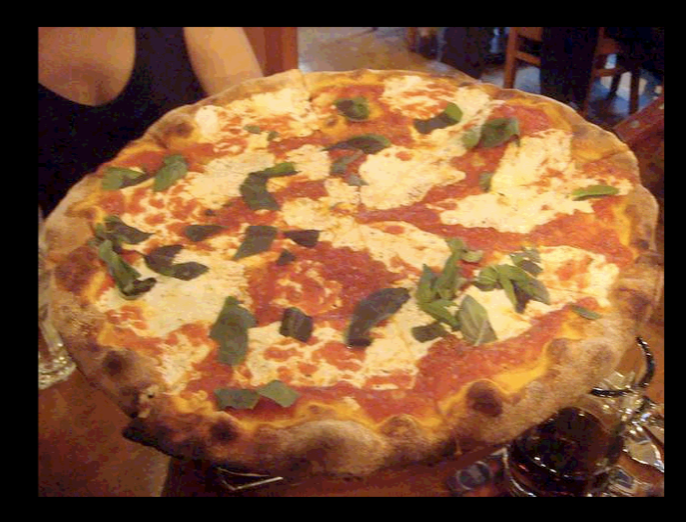
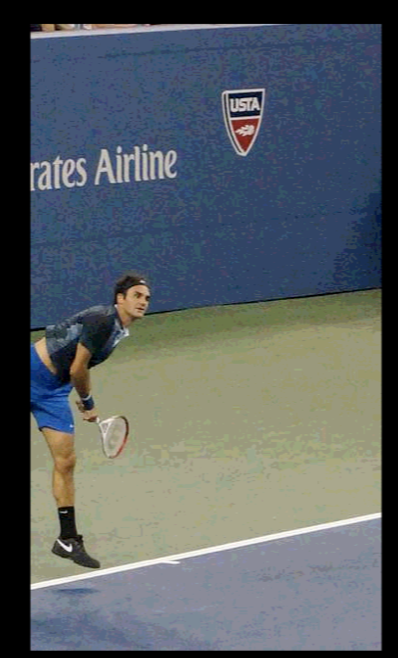
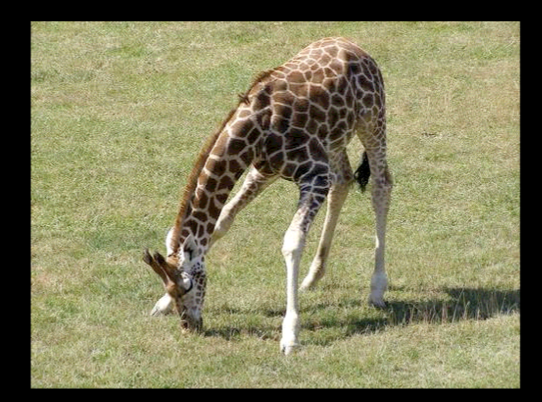

# Implement VQA
This is a project that use lstm, CNN to build the vqa system. Besides, it incorporate depth information to perfrom better reasoning
The data is from [VQA](http://www.visualqa.org), and it uses vgg to extract image feature.
## How to use
1. Make sure tensorflow is installed
2. Download data from VQA
3. Modify the path in loader.py to the correct images and questions
4. Run following: 
```
python image_extract.py
python train.py
```
5. Finally, can run `predict.py` to feed in your question and image

## Results
| Images                            | questions                 | Ans    |
| ----------------------------------|---------------------------|--------|
| | What is the food?         | pizza  |
| | What sport is he playing? | tennis |
| | What kind of animal is it?| giraffe|
